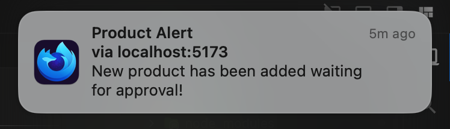

# Web Push Desktop Notification Starter

## How to Use?

### Generate VAPID public and private key

```bash
npx web-push generate-vapid-keys
```

You will see something like this

```bash
=======================================

Public Key:
VAPID_PUBLIC_KEY


Private Key:
VAPID_PRIVATE_KEY

=======================================
```

Copy those key to `backend/constants.js` and `frontend/src/App.tsx:12`

### Run the program

```bash
bash start.sh
```

### Test the notification

```bash
curl -X POST \
  -H "Content-Type: application/json" \
  -d '{
    "userId": "RANDOM_USER_ID",
    "notificationPayload": {
      "title": "Product Alert",
      "body": "New product has been added waiting for approval!",
      "icon": "path/to/icon.png",
      "badge": "path/to/badge.png"
    }
  }' \
  http://localhost:3000/send-notification
```

You will see notification


